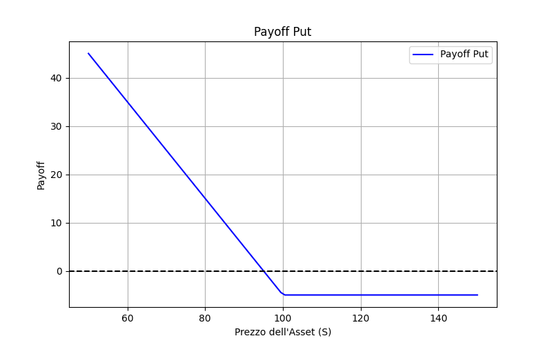
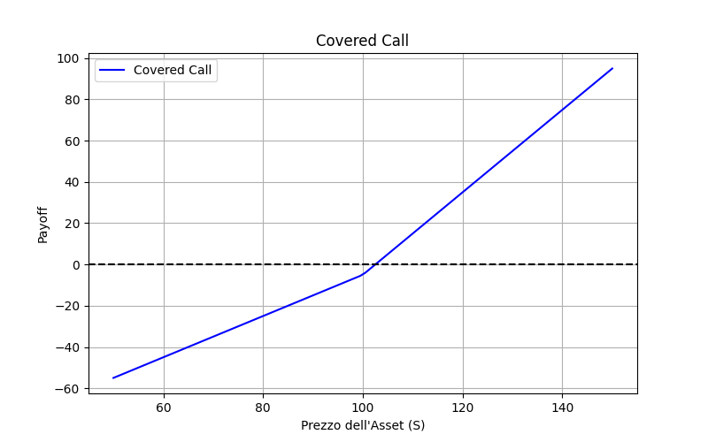
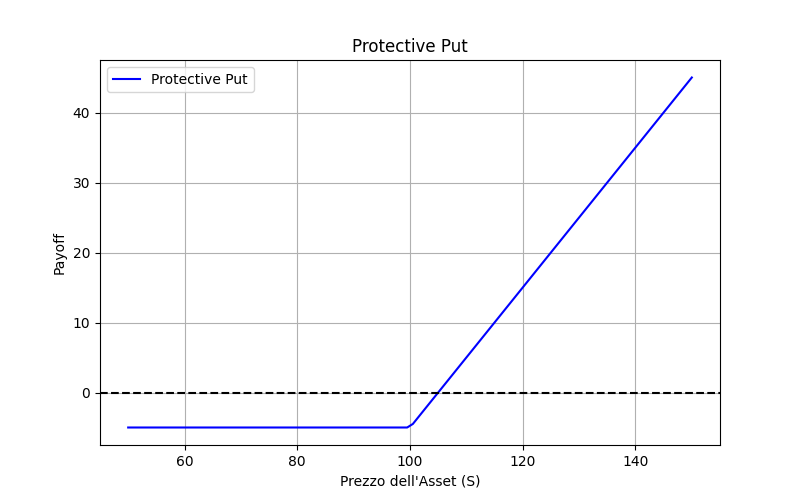
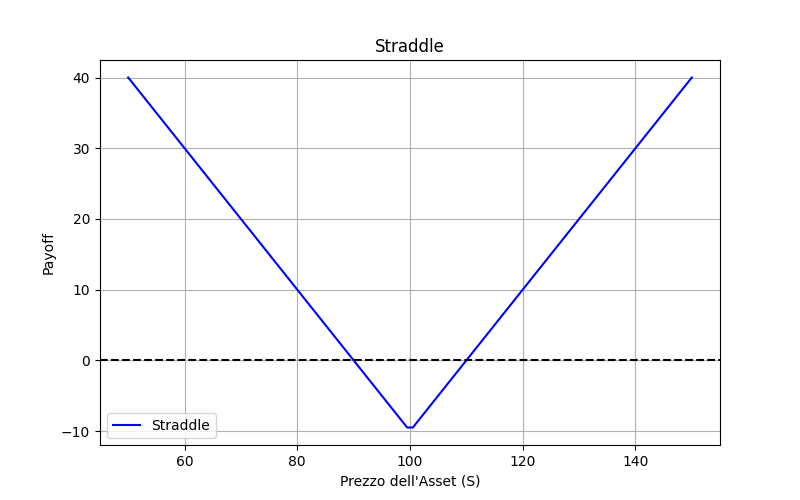

# 📌 Opzioni Finanziarie: Tipologie, Strategie e Applicazioni su Commodities e Crypto

## 📖 Introduzione
Le **opzioni finanziarie** sono strumenti derivati che conferiscono il diritto, ma non l'obbligo, di acquistare o vendere un'attività sottostante a un prezzo prestabilito entro una determinata scadenza...

## 🔹 Tipologie di Opzioni
- **Call Option (Opzione di Acquisto):** Dà il diritto di acquistare l'asset sottostante a un prezzo stabilito.
- **Put Option (Opzione di Vendita):** Dà il diritto di vendere l'asset sottostante a un prezzo stabilito.

## 🔹 Strategie Combinatorie con Opzioni

### 1️⃣ Covered Call

### 2️⃣ Protective Put

### 3️⃣ Straddle

## 🎯 Conclusione
Le opzioni finanziarie sono strumenti potenti sia per trader che per aziende che vogliono proteggersi dai rischi di prezzo.
